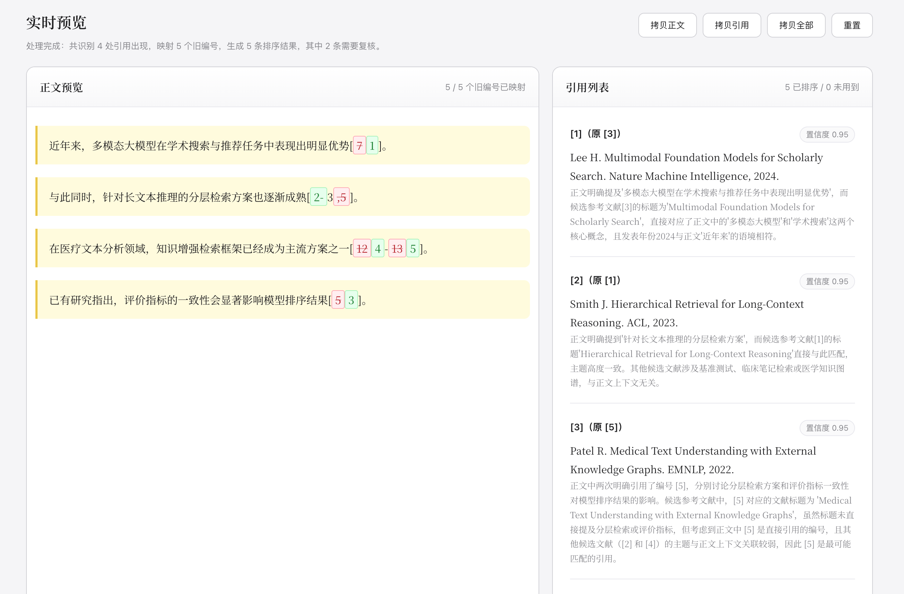

# 理顺

一个极简的 AI 论文引用重排工具。粘贴正文与参考文献，按正文中的实际出现顺序重排引用编号，并实时给出新的正文与参考文献列表。

**[→ 在线使用](https://jackielyu.is-a.dev/Lishun/)**

## 示例效果

## 功能概览

- 粘贴论文正文，识别常见引用格式，如 `[1]`、`[1,2,3]`、`[2-5]`
- 粘贴原始参考文献列表，先整理为统一编号格式
- 基于正文上下文与参考文献信息，重新匹配并排序引用编号
- 实时预览新的正文、引用列表与汇总结果
- 支持拷贝正文、拷贝引用、拷贝全部结果

## 使用方式

1. 打开页面。
2. 点击右上角“配置”，填写 API 地址。
3. 在左侧粘贴论文正文，在右侧粘贴参考文献列表。
4. 点击“开始排序”，等待处理完成后拷贝结果。

## 局限说明
> AI 只是协助，还要自己确认。

1. 引用匹配依赖模型判断，低置信度结果需要人工复核。
2. 参考文献原始格式过于混乱时，整理结果可能需要二次检查。
3. 页面为纯静态 HTML，不会在服务端保存内容，但你的正文与参考文献会在处理时发送到你配置的模型接口。

## 免责声明
本工具为个人开发的轻量 Demo，仅供辅助参考。页面为纯静态 HTML，不会保存任何用户数据——你的文本仅在校对时发送至所配置的 AI 模型进行检测。

---

  如果这个极简的小工具恰好帮助到了你，欢迎留下 <strong>Star 🌟</strong> 
  Built with ❤️ by <a href="https://github.com/may3rr">jackielyu</a>

